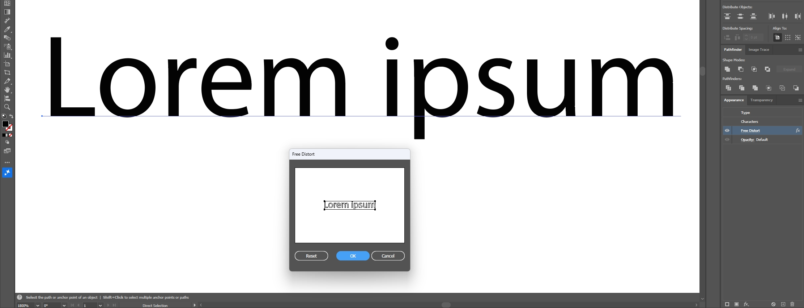
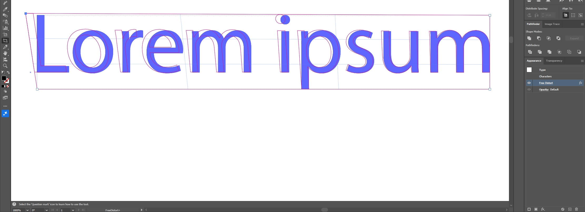
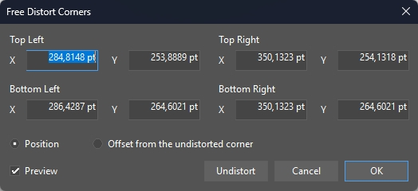

# FreeDistort+

An on-canvas editor for Adobe Illustrator's built-in *Free Distort* effect.

## Why

Adobe's own dialog edits the effect in a thumbnail-sized wireframe and rounds every corner to a whole point.

This plugin lets you drag the four corners directly over your artwork, at any zoom, at the pointer's exact position, while an outline shows where Illustrator will draw the result.

By double-clicking on the tool, you get access to a numerical editor for precise fine-tuning.

**It edits Adobe's effect; it does not replace it.** The *Appearance* panel still says *Free Distort*, because it is Adobe's *Free Distort*. A document edited with this plugin opens normally on a machine without it, draws the same, and can still be edited there in Adobe's own *Free Distort* dialog. When the plugin is back, it picks up whatever that dialog changed.

## Install

**Do not double-click *FreeDistortPlus.aip*.** It is a plugin, not a document; double-clicking it makes Illustrator try to open it as artwork and answer that the file format is unknown.

1. Quit Illustrator. It reads its plugin folders only at startup, and holds a loaded plugin open.
2. Download *FreeDistortPlus-0.1.0.zip* from the [latest release](../../releases/latest) and put *FreeDistortPlus.aip* in the shared plugin folder for Illustrator 2026, *%LOCALAPPDATA%\Adobe Illustrator Plug-ins\30*, creating it if it is not there. Other plugins live there too; do not make a folder of its own.
3. If you have not already, point *Edit > Preferences > Plug-ins & Scratch Disks > Additional Plug-ins Folder* at that folder once, then restart Illustrator.

No administrator rights are needed. Install only one copy: the same file name in both Illustrator's own *Plug-ins* folder and the additional folder makes Illustrator ignore the additional folder entirely. To uninstall, quit Illustrator and delete the *.aip*. *INSTALL.txt* in the archive says all of this in full.

## Use

1. Select one object.
2. Choose *Effect > Distort & Transform > FreeDistort+…* (if Illustrator put it elsewhere, *Object > Transform > FreeDistort+…*). The object gets a *Free Distort* if it has none, and the *FreeDistort+* tool is selected.
3. Drag a corner handle. While you drag, a magenta outline shows exactly where Illustrator will draw every edge; the artwork itself updates when you release. The keys are those of Illustrator's *Free Transform* tool in its *Free Distort* mode: *Shift* keeps the corner on one axis, *Alt* moves the opposite corner the other way, and *Shift+Alt* moves the other corner of the edge the other way, like *Free Transform*'s perspective. *Ctrl* changes nothing, so the keys you hold for *Free Transform* work here too. *Esc* during a drag cancels it.
4. For exact numbers, double-click the *FreeDistort+* tool icon, or *Alt*-click a handle. The *Free Distort Corners* dialog takes each corner as a position on Illustrator's rulers or as an offset from the undistorted corner, in any unit and with arithmetic, the way Illustrator's own fields do. *Undistort* puts every corner back; holding *Alt* turns *Cancel* into *Reset*.
5. With *View > Smart Guides* on, a dragged corner snaps where Illustrator's tools snap, and back to where it is undistorted, to the undistorted center, and to where the other corners are.
6. Click a handle to select that corner, then use the arrow keys to move it by Illustrator's *Keyboard Increment*, ten times as far with *Shift*. With no corner selected, the arrow keys move the artwork as usual.
7. Each drag, each dialog, and each arrow key press is one step in *Edit > Undo*.

Double-clicking *Free Distort* in the *Appearance* panel still opens Adobe's dialog.

## What it does not do

- No editing of a *Free Distort* applied to a fill or stroke rather than the whole object, and no macOS build.
- *Shift+Alt* makes the edge converge, but the artwork inside is not foreshortened the way *Free Transform*'s perspective foreshortens it: Adobe's *Free Distort* cannot store that.
- The outline during a drag needs *Free Distort* to be the last effect in the appearance; otherwise a drag shows only the handles until you release. Illustrator itself does not redraw the artwork inside a tool's drag.
- No reference point, rotate, or scale handles yet. Raster images are declined, with a reason.

Every feature and its status is in [docs/FREE_DISTORT_SUPPORT_MATRIX.md](docs/FREE_DISTORT_SUPPORT_MATRIX.md).

## More

- [RELEASE_NOTES.md](RELEASE_NOTES.md): what each release contains, and what was tested
- [docs/FREEDISTORT_PLUS_INVESTIGATION.md](docs/FREEDISTORT_PLUS_INVESTIGATION.md): what Adobe's effect actually does, and why the plugin is built this way
- [docs/BUILDING.md](docs/BUILDING.md): building, installing from source, the tests, and making a release

## License

GPL-3.0-or-later, with an Adobe Illustrator SDK linking exception: see [LICENSE](LICENSE) and [LICENSE-EXCEPTION](LICENSE-EXCEPTION). Copyright © 2026 Vixen420.
